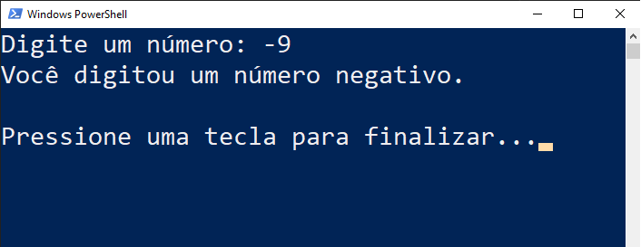

# Negativo

Este programa lê um número inteiro e exibe a mensagem "Você digitou um número negativo." caso o número seja menor que zero.

## Exemplo

```
Digite um número: -8
Você digitou um número negativo.     

Pressione uma tecla para finalizar...
```

## Screenshot



## Download

Baixe o arquivo abaixo. Descompacte na pasta desejada.

[🗃 Download do arquivo .zip](dist/Negativo.zip)

Execute utilizando o comando:

```
dotnet ObrigadoDevCSharp.dll
```

> ℹ Dica: Se você estiver no Windows, pode dar um duplo-clique no ícone do programa.

## Agradecimentos

- [Etec Adolpho Berezin](https://etecab.cps.sp.gov.br)
- [Prof. Ermogenes](https://github.com/ermogenes)
- [Prof. Diego Neri](https://github.com/diegoneri)
- [Dev C#](https://github.com/ermogenes/aulas-programacao-csharp)

---

Todos os direitos reservados. PIRATARIA É CRIME.